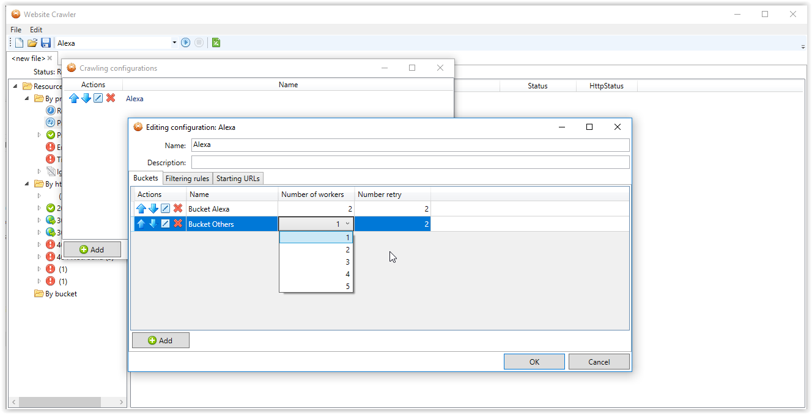
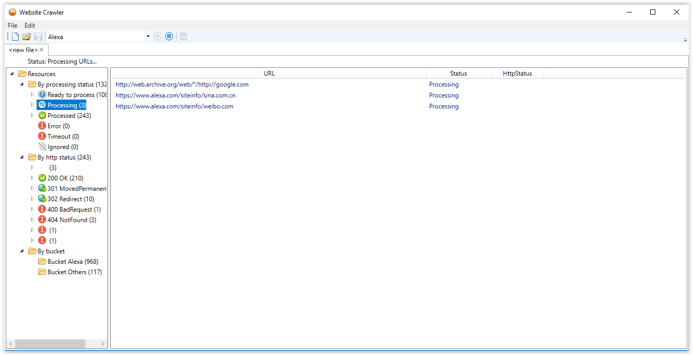
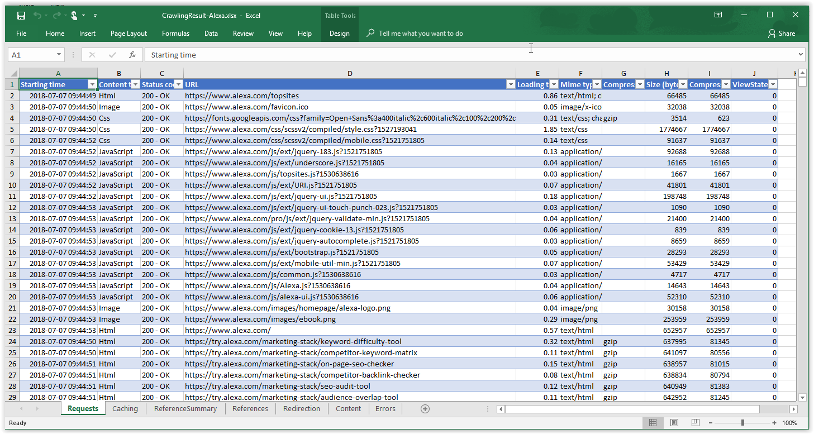
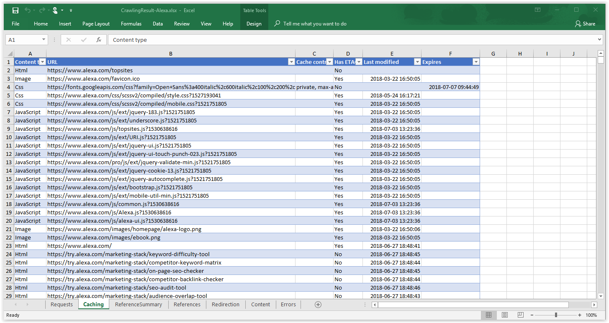
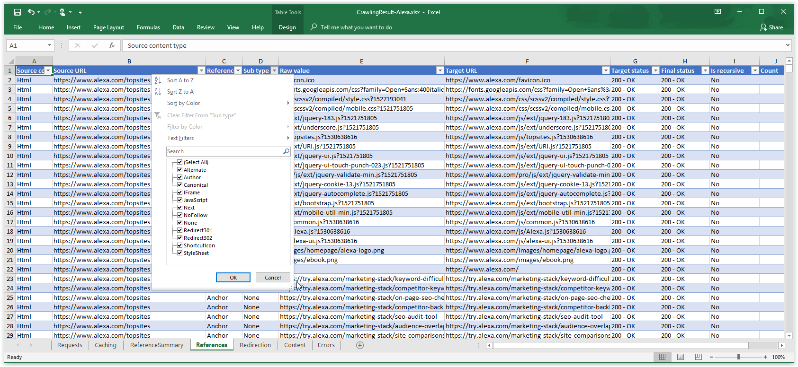
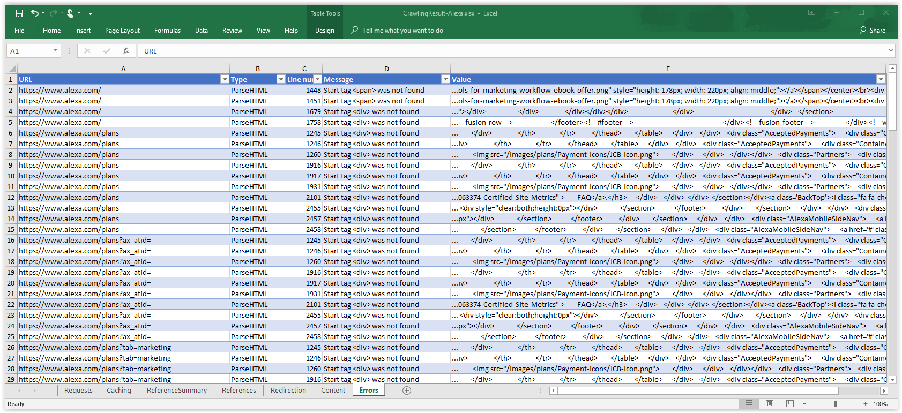

# WebsiteCrawler
WebsiteCrawler is an open-source application to generate reports based on references between the pages of a website.

## Crawling
This application allows you to configure how you want to crawl through your website. You will have the create the following elements:
* Bucket: Define the speed at which your resources will be processed. Simply create one and leave the default.
* Rule: Define what are the boundaries of the crawler. Each rule define a different boundary. Ex:
  * Rule Example.com would be configured to never leave Example.com and follow every link
  * Rule Others would be configured to validate that the external links are valid, but stop after validating it is working.
* Starting URLs: Gives a hint to the crawler where to start. Typically, this will be a SiteMap or a Home page.

## Reporting

### Report Request
This tab have a summary of all the HTTP requests and the response time and size.

### Report Caching
This tab give you a quick view of which resources are cached and which are not, using which mechanism (Cache output, Etag, Expires).

### Report References
This tab has a list of all the resources that are linked together. Supported types are:

*Alternate, Archives, Author, Bookmark, Canonical, External, First, Help, Icon, Last, License, Next, NoFollow, NoReferrer, Pingback, Prefetch, Prev, Search, SideBar, StyleSheet, Tag, Up, Redirect301, Redirect302, Redirect303, Redirect307, ShortcutIcon, JavaScript, Sitemap, Frame, IFrame, Fallback*

### Report Errors
List of all the errors found while processing:
- HTML errors
- URI not valid
- HTTPS using HTTP resource

